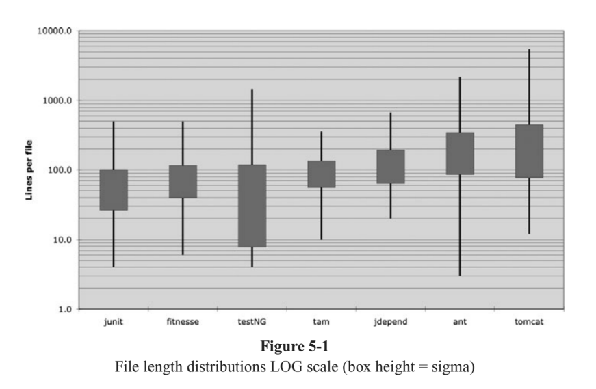

# Форматування

> Formatting
----

Коли люди заглядають під капот, ти хочеш їх здивувати охайністю, послідовністю і приділеною увагою до деталей яку вони відчувають. Ми хочемо, щоб їх вразила впорядкованість, щоб їх брови піднімалися під час прокрутки модулів. Ми хочемо, щоб вони зрозуміли, що професіонали працюють.
Якщо замість цього вони побачать шифровану масу коду, схожої на те, що вона була написана групкою п'яних моряків, то вони, швидше за все, прийдуть до висновку, що однакова неуважність до деталей пронизує всі інші аспекти проекту.

Ви повинні подбати про те, щоб ваш код був добре відформатований. Вам слід вибрати набір простих правил, які регулюють формат вашого коду, а потім слід послідовно застосовувати ці правила. Якщо ви працюєте в команді, тоді команда повинна погодитись на єдиний набір правил форматування, і всі члени повинні дотримуватися. Це допомагає мати автоматизований інструмент, який може застосувати ці правила форматування для вас.

> Код має бути структурований, форматований і читабельний

## Мета форматування

> The Purpose of Formatting
----

Перш за все, давайте прояснимо. Форматування коду має важливе значення. Це занадто важливо щоб ігнорувати і занадто важливо ставитись релігійно. Форматування коду стосується спілкування, а спілкування - це перший порядок ведення бізнесу професійним розробником.

Можливо, ви думали, що "змусити його працювати" - це перше правило ведення бізнесу в компанії професійного розробника. Однак я сподіваюся, що ця книга вже вас відмовила від цієї ідеї. Функціонал, який ви створюєте сьогодні, має великі шанси змінитися в наступному релізах, але читабельність вашого коду матиме глибокий вплив на всі зміни що коли-небудь буде зроблено. Стиль кодування та читабельність створюють прецеденти, які продовжуються впливають на ремонтопридатність та розширюваність ще довго після того, як було змінено вихідний код до невпізнання. Ваш стиль і дисципліна виживають, навіть якщо ваш код ні.
То які проблеми форматування допомагають нам найкраще спілкуватися?

> Працює не означає добре. Читабельність і впорядкованість, впливає на майбутню ремонтопридатність, розширеність

## Вертикальне форматування

> Vertical Formatting

Почнемо з вертикального розміру. Наскільки великим повинен бути вихідний файл? У Java розмір файлу тісно пов'язаний з розміром класу. Про розмір класу ми поговоримо, коли поговоримо про класи. На даний момент давайте просто розглянемо розмір файлу.

Наскільки великі більшість вихідних файлів Java? Виявляється, існує величезний діапазон розмірів і деякі чудові відмінності в стилі. Приклад 5-1 показує деякі з цих відмінностей. Зображено сім різних проектів.

**Приклад 5-1:**

Зображено сім різних проектів. Junit, FitNesse, testNG, Time and Money, JDepend, Ant і Tomcat. Рядки в полях показують мінімальну та максимальну довжину файлів у кожному проекті. У полі відображається приблизно одна третина (одне стандартне відхилення) файлів. Середина коробки є середнім значенням. Отже, середній розмір файлу в проекті FitNesse становить близько 65 рядків, а приблизно третина файлів займає від 40 до 100 рядків. Найбільший файл у FitNesse - це близько 400 рядків, а найменший - 6 рядків.
Зверніть увагу, що це шкала журналу, тому мала різниця у вертикальному положенні передбачає дуже велику різницю в абсолютних розмірах.

Junit, FitNesse та Time and Money складаються з відносно невеликих файлів. Жоден не має більше 500 рядків, і більшість із цих файлів мають менше 200 рядків. Tomcat і Ant, з іншого боку, мають деякі файли довжиною в кілька тисяч рядків і близько половини - понад 200 рядків.

Що це означає для нас? Здається, можливо побудувати значні системи (FitNesse близько 50 000 рядків) з файлів, які зазвичай мають довжину 200 рядків, з верхньою межею 500. Хоча це не повинно бути жорстким правилом, це слід вважати дуже бажаний. Маленькі файли зазвичай легше зрозуміти, ніж великі.

### The Newspaper Metaphor

Згадайте добре написану газетну статтю. Ви читаєте це вертикально. Угорі ви очікуєте заголовок, який розповість вам, про що йдеться в історії, і дозволяє вирішити, чи є це те, що ви хочете прочитати. Перший абзац дає конспект усієї історії, приховуючи всі деталі, надаючи широкі концепції. Продовжуючи рух вниз, деталі збільшуються, поки не з’являться всі дати, імена, цитати, претензії та інші деталі.

Ми хотіли б, щоб вихідний файл був схожий на газетну статтю. Назва повинна бути простою, але пояснювальною. Назва сама по собі повинна бути достатньою, щоб сказати нам, чи правильний ми модуль чи ні. Верхні частини вихідного файлу повинні містити концепції та алгоритми високого рівня. Детальність повинна збільшуватися, коли ми рухаємося вниз, поки в кінці ми не знайдемо функції та деталі найнижчого рівня у вихідному файлі.

Газета складається з багатьох статей; більшість - дуже малі. Деякі трохи більші. Дуже мало людей містять стільки тексту, скільки вміщує сторінка. Це робить газету придатною для використання. Якщо
газета була лише однією довгою історією, що містила неорганізовану сукупність фактів, дат та імен, тоді ми просто не хотіли б її читати.

### Vertical Opennes Between Concepts

Майже весь код читається зліва направо і зверху вниз. Кожен рядок представляє вираз або речення, а кожна група рядків представляє завершену думку. Ці думки слід відокремлювати порожніми рядками.

Розглянемо, наприклад, лістинг 5-1. Є порожні рядки, які відокремлюють декларацію пакету, імпорт (и) та кожну з функцій. Це надзвичайно просте правило глибоко впливає на візуальне розташування коду. Кожен порожній рядок - це візуальна підказка, яка визначає нову та окрему концепцію. Коли ви скануєте список, ваш погляд привертається до першого рядка, що слідує за порожнім рядком.

{code}

### Vertical Density

### Vertical Distance

### Vertical Ordering

## Horizontal Formatting

### Horizontal Openness and Density

### Horizontal Alignment

### Indentation

### Dummy Scores

## Team Rules

## Uncle Bob's Formatting Rules