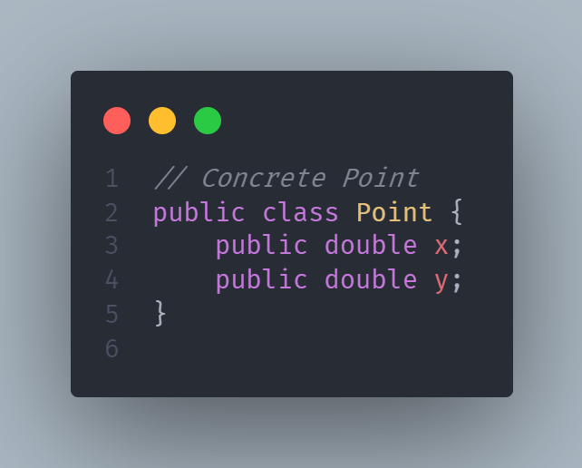
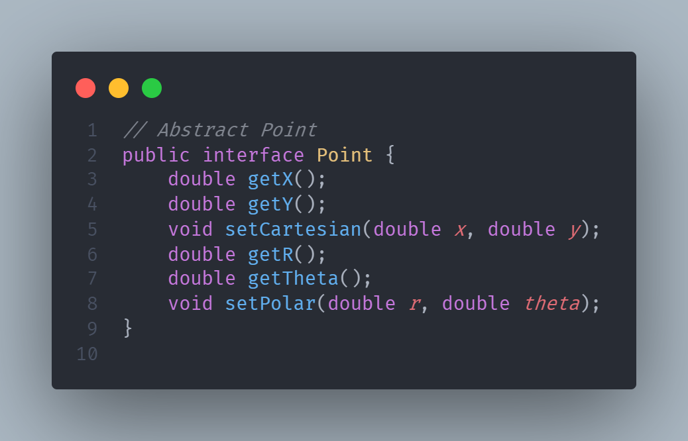

# 6. Структури обєктів та даних

> Object and Data Structures
----

Існує багато причин чому ми залишаємо свої змінні приватними. Ми не хочемо, щоб хтось інший залежав від них. Ми хочемо зберегти свободу змінювати їх тип чи реалізацію на примху чи імпульс. Чому ж тоді так багато програмістів автоматично додають геттери та сетери до своїх об’єктів, виставляючи свої приватні змінні так, ніби вони публічні?

## Абстракція Даних

> Data Abstraction
----

Розглянемо різницю між Прикладом 6-1 та Прикладом 6-2. Обидва вони представляють дані точки на Декартовій площині. І все ж один викриває його реалізацію, а інший - повністю приховує.

**Приклад 6-1:**

**Приклад 6-2:**

Найкрасивішим у Прикладі 6-2 є те, що жодним чином не можна визначити, чи реалізація має прямокутні або полярні координати. Це може бути ні те, ні інше! І все ж інтерфейс все ще безпомилково представляє структуру даних. Але це не лише структура даних. Методи забезпечують політику доступу. Ви можете зчитувати окремі координати самостійно, але ви повинні встановити координати разом як атомну операцію.

З іншого боку, Приклад 6-1 дуже чітко реалізований у прямокутних координатах, і це змушує нас маніпулювати цими координатами самостійно. Це піддає реалізації. Дійсно, це виявило б реалізацію, навіть якщо змінні були приватними, і ми використовували одинарні "геттери" та "сеттери" змінних.

Listing 6-1, on the other hand, is very clearly implemented in rectangular coordinates, and it forces us to manipulate those coordinates independently. This exposes implementation. Indeed, it would expose implementation even if the variables were private and we were using single variable getters and setters.

Приховування реалізації - це не просто питання розміщення шару функцій між змінними. Приховування реалізації - це абстракції! Клас не просто виштовхує свої змінні через геттери та сетери. Швидше він надає абстрактні інтерфейси, які дозволяють своїм користувачам маніпулювати суттю даних, не знаючи їх реалізації.
Розгляньте лістинг 6-3 і лістинг 6-4. Перший використовує конкретні терміни для передачі рівня палива транспортного засобу, тоді як другий використовує це із абстракцією відсотків. У конкретному випадку ви можете бути майже впевнені, що це лише пристосування змінних. В абстрактному випадку ви взагалі не підозрюєте про форму даних.

Hiding implementation is not just a matter of putting a layer of functions between the variables. Hiding implementation is about abstractions! A class does not simply push its variables out through getters and setters. Rather it exposes abstract interfaces that allow its users to manipulate the essence of the data, without having to know its implementation.
Consider Listing 6-3 and Listing 6-4. The first uses concrete terms to communicate the fuel level of a vehicle, whereas the second does so with the abstraction of percentage. In the concrete case you can be pretty sure that these are just accessors of variables. In the abstract case you have no clue at all about the form of the data.

Listing 6-3
Concrete Vehicle

-

Listing 6-4
Abstract Vehicle

-

В обох вищезазначених випадках другий варіант є кращим. Ми не хочемо розкривати деталі наших даних. Натомість ми хочемо висловити свої дані абстрактно. Це не просто досягається за допомогою інтерфейсів та / або геттерів та сеттерів. Потрібно вкласти серйозну думку в найкращий спосіб представити дані, що містяться в об’єкті. Найгірший варіант - дрібно додавати геттери та сетери.

In both of the above cases the second option is preferable. We do not want to expose the details of our data. Rather we want to express our data in abstract terms. This is not merely accomplished by using interfaces and/or getters and setters. Serious thought needs to be put into the best way to represent the data that an object contains. The worst option is to blithely add getters and setters.

## Антисемметрія даних/обєктів

> Data/Object Anti-Symmetry

Ці два приклади показують різницю між об’єктами та структурами даних. Об'єкти приховують свої дані за абстракціями та виставляють функції, які працюють з цими даними. Структура даних відкриває їх дані і не має жодних значущих функцій. Поверніться і прочитайте це ще раз.

These two examples show the difference between objects and data structures. Objects hide their data behind abstractions and expose functions that operate on that data. Data structure expose their data and have no meaningful functions. Go back and read that again.

Notice the complimentary nature of the two definitions. They are virtual opposites. This difference may seem trivial, but it has far-reaching implications. Consider, for example, the procedural shape example in Listing 6-5. The Geometry class operates on the three shape classes. The shape classes are simple data structures without any behavior. All the behavior is in the Geometry class.

Listing 6-5
Procedural Shape

Listing 6-5 (continued)
Procedural Shape

Object-oriented programmers might wrinkle their noses at this and complain that it is procedural—and they’d be right. But the sneer may not be warranted. Consider what would happen if a perimeter() function were added to Geometry. The shape classes would be unaffected! Any other classes that depended upon the shapes would also be unaffected! On the other hand, if I add a new shape, I must change all the functions in Geometry to deal with it. Again, read that over. Notice that the two conditions are diametrically opposed. Now consider the object-oriented solution in Listing 6-6. Here the area() method is polymorphic. No Geometry class is necessary. So if I add a new shape, none of the existing functions are affected, but if I add a new function all of the shapes must be changed!

Listing 6-6
Polymorphic Shapes

Listing 6-6 (continued)
Polymorphic Shapes

Again, we see the complimentary nature of these two definitions; they are virtual opposites!
This exposes the fundamental dichotomy between objects and data structures:
Procedural code (code using data structures) makes it easy to add new functions without changing the existing data structures. OO code, on the other hand, makes it easy to add new classes without changing existing functions.
The complement is also true:
Procedural code makes it hard to add new data structures because all the functions must change. OO code makes it hard to add new functions because all the classes must change. So, the things that are hard for OO are easy for procedures, and the things that are hard for procedures are easy for OO!
In any complex system there are going to be times when we want to add new data types rather than new functions. For these cases objects and OO are most appropriate. On the other hand, there will also be times when we’ll want to add new functions as opposed to data types. In that case procedural code and data structures will be more appropriate.

Mature programmers know that the idea that everything is an object is a myth. Sometimes you really do want simple data structures with procedures operating on them.

## Закон Диметри
> The Law of Demeter

There is a well-known heuristic called the Law of Demeter2 that says a module should not
know about the innards of the objects it manipulates. As we saw in the last section, objects
hide their data and expose operations. This means that an object should not expose its
internal structure through accessors because to do so is to expose, rather than to hide, its
internal structure.
More precisely, the Law of Demeter says that a method f of a class C should only call
the methods of these:
- C
- An object created by f
- An object passed as an argument to f
- An object held in an instance variable of C

The method should not invoke methods on objects that are returned by any of the
allowed functions. In other words, talk to friends, not to strangers.
The following code3 appears to violate the Law of Demeter (among other things)
because it calls the getScratchDir() function on the return value of getOptions() and then
calls getAbsolutePath() on the return value of getScratchDir().
final String outputDir = ctxt.getOptions().getScratchDir().getAbsolutePath();
### Train Wrecks

This kind of code is often called a train wreck because it look like a bunch of coupled train
cars. Chains of calls like this are generally considered to be sloppy style and should be
avoided [G36]. It is usually best to split them up as follows:

Options opts = ctxt.getOptions();
File scratchDir = opts.getScratchDir();
final String outputDir = scratchDir.getAbsolutePath();

Are these two snippets of code violations of the Law of Demeter? Certainly the containing module knows that the ctxt object contains options, which contain a scratch directory, which has an absolute path. That’s a lot of knowledge for one function to know. The calling function knows how to navigate through a lot of different objects.

Whether this is a violation of Demeter depends on whether or not ctxt, Options, and ScratchDir are objects or data structures. If they are objects, then their internal structure should be hidden rather than exposed, and so knowledge of their innards is a clear violation of the Law of Demeter. On the other hand, if ctxt, Options, and ScratchDir are just data structures with no behavior, then they naturally expose their internal structure, and so Demeter does not apply.

The use of accessor functions confuses the issue. If the code had been written as follows, then we probably wouldn’t be asking about Demeter violations.

final String outputDir = ctxt.options.scratchDir.absolutePath;

This issue would be a lot less confusing if data structures simply had public variables and no functions, whereas objects had private variables and public functions. However, there are frameworks and standards (e.g., “beans”) that demand that even simple data
structures have accessors and mutators.
### Hybrids
This confusion sometimes leads to unfortunate hybrid structures that are half object and
half data structure. They have functions that do significant things, and they also have either
public variables or public accessors and mutators that, for all intents and purposes, make
the private variables public, tempting other external functions to use those variables the
way a procedural program would use a data structure.4
Such hybrids make it hard to add new functions but also make it hard to add new data
structures. They are the worst of both worlds. Avoid creating them. They are indicative of a
muddled design whose authors are unsure of—or worse, ignorant of—whether they need
protection from functions or types.
### Hiding Structure
What if ctxt, options, and scratchDir are objects with real behavior? Then, because
objects are supposed to hide their internal structure, we should not be able to navigate
through them. How then would we get the absolute path of the scratch directory?
ctxt.getAbsolutePathOfScratchDirectoryOption();
or
ctx.getScratchDirectoryOption().getAbsolutePath()

The first option could lead to an explosion of methods in the ctxt object. The second pre-
sumes that getScratchDirectoryOption() returns a data structure, not an object. Neither

option feels good.
If ctxt is an object, we should be telling it to do something; we should not be asking it
about its internals. So why did we want the absolute path of the scratch directory? What
were we going to do with it? Consider this code from (many lines farther down in) the
same module:
String outFile = outputDir + "/" + className.replace('.', '/') + ".class";
FileOutputStream fout = new FileOutputStream(outFile);
BufferedOutputStream bos = new BufferedOutputStream(fout);
The admixture of different levels of detail [G34][G6] is a bit troubling. Dots, slashes,
file extensions, and File objects should not be so carelessly mixed together, and mixed

with the enclosing code. Ignoring that, however, we see that the intent of getting the abso-
lute path of the scratch directory was to create a scratch file of a given name.

So, what if we told the ctxt object to do this?
BufferedOutputStream bos = ctxt.createScratchFileStream(classFileName);
That seems like a reasonable thing for an object to do! This allows ctxt to hide its
internals and prevents the current function from having to violate the Law of Demeter by
navigating through objects it shouldn’t know about.

## Data Transfer Objects

The quintessential form of a data structure is a class with public variables and no func-
tions. This is sometimes called a data transfer object, or DTO. DTOs are very useful struc-
tures, especially when communicating with databases or parsing messages from sockets,

and so on. They often become the first in a series of translation stages that convert raw data
in a database into objects in the application code.
Somewhat more common is the “bean” form shown in Listing 6-7. Beans have private
variables manipulated by getters and setters. The quasi-encapsulation of beans seems to
make some OO purists feel better but usually provides no other benefit.

Listing 6-7
address.java

Listing 6-7 (continued)
address.java

### Active Record
Active Records are special forms of DTOs. They are data structures with public (or bean-
accessed) variables; but they typically have navigational methods like save and find. Typi-
cally these Active Records are direct translations from database tables, or other data

sources.
Unfortunately we often find that developers try to treat these data structures as though
they were objects by putting business rule methods in them. This is awkward because it
creates a hybrid between a data structure and an object.
The solution, of course, is to treat the Active Record as a data structure and to create
separate objects that contain the business rules and that hide their internal data (which are
probably just instances of the Active Record).

## Conclusion

Objects expose behavior and hide data. This makes it easy to add new kinds of objects
without changing existing behaviors. It also makes it hard to add new behaviors to existing
objects. Data structures expose data and have no significant behavior. This makes it easy to
add new behaviors to existing data structures but makes it hard to add new data structures
to existing functions.
In any given system we will sometimes want the flexibility to add new data types, and
so we prefer objects for that part of the system. Other times we will want the flexibility to
add new behaviors, and so in that part of the system we prefer data types and procedures.
Good software developers understand these issues without prejudice and choose the
approach that is best for the job at hand.

## Bibliography

[Refactoring]: Refactoring: Improving the Design of Existing Code, Martin Fowler et al.,
Addison-Wesley, 1999.